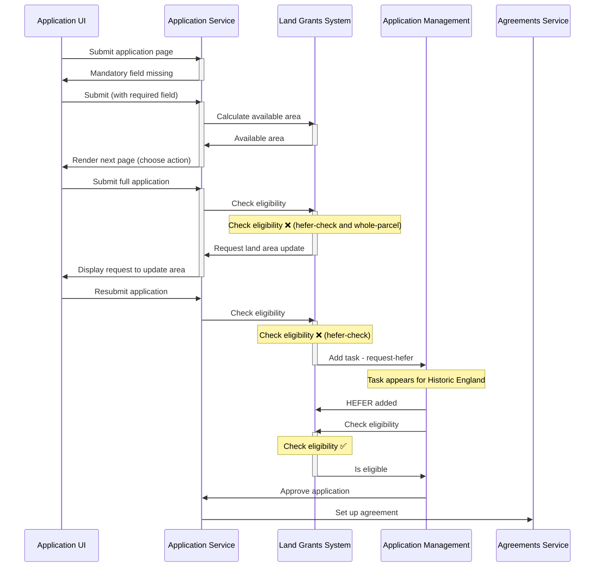
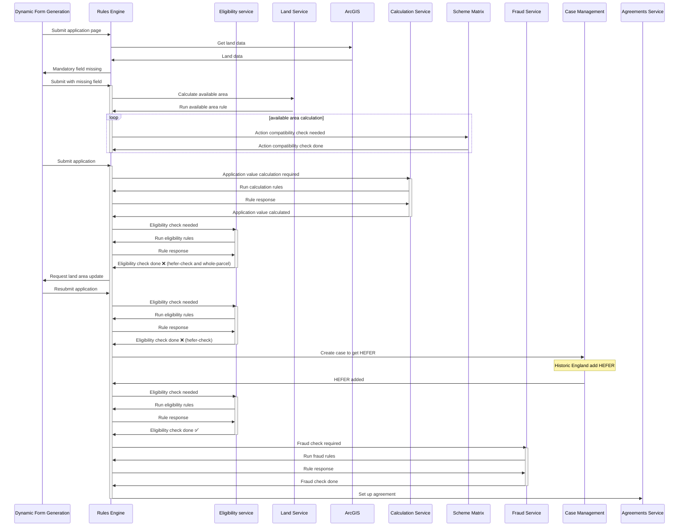

# Example Application Submission

The following is an example of how a flow of events could work in the land grants domain.

It will show an applicant submitting an application for the action [CSAM1](https://www.gov.uk/find-funding-for-land-or-farms/csam1-assess-soil-produce-a-soil-management-plan-and-test-soil-organic-matter). CSAM1 requires the
total available area of the land parcel be applied for. It also requires a Historic Environment Farm Environment Record  (HEFER) from Historic
England if any Historic Features are present on the parcel.

The application will be for too small an area and will not yet have a HEFER for its historical
feature. Therefore two actions will be required, the user must update the applied for area to to whole available area and Historic England must issue a HEFER. The former will prevent the application from being submitted and the latter will not.

The Land Grants System will have configuration for each rule determining what should be done if an
eligibility criterion fail.

## Proposed version

Note: The real process would include the single front door, Defra.id etc. These have been excluded for clarity.

## Architecture vision version

